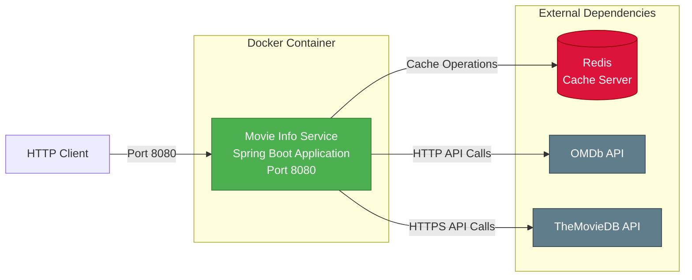
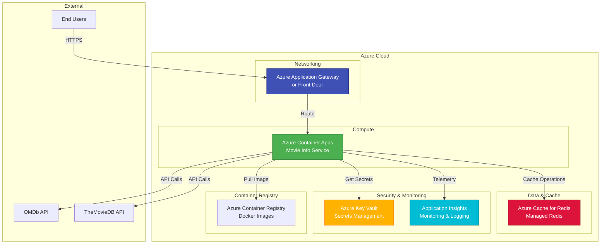

# Movie Info Service - Architecture Diagram

This document contains the architecture diagram for the movie-info-service application.

## System Architecture

The following diagram shows the overall architecture of the Movie Info Service:

```mermaid
graph TB
    subgraph "Client Layer"
        Client[HTTP Client/Browser]
    end
    
    subgraph "Movie Info Service"
        Controller[MovieInfoController<br/>REST API]
        Service[MovieInfoService<br/>Business Logic]
        Factory[ClientFactory<br/>Client Manager]
        
        subgraph "API Clients"
            OmdbClient[OmdbClient<br/>OMDb API Integration]
            MoviedbClient[MoviedbClient<br/>TheMovieDB Integration]
            IMovieClient[IMovieClient<br/>Interface]
        end
        
        Helper[WebClientHelper<br/>HTTP Client Config]
    end
    
    subgraph "External Services"
        Redis[(Redis Cache<br/>Movie Data)]
        OMDbAPI[OMDb API<br/>www.omdbapi.com]
        TheMovieDB[The Movie DB API<br/>api.themoviedb.org]
    end
    
    subgraph "Infrastructure"
        Docker[Docker Container<br/>openjdk:8-jdk-alpine]
        Tomcat[Tomcat Server<br/>Port 8080]
    end
    
    Client -->|HTTP GET /movies/{api}| Controller
    Client -->|HTTP GET /movies/flux/{api}| Controller
    Controller -->|Call Service| Service
    Service -->|Get Client| Factory
    Factory -->|Return Client Instance| Service
    Service -->|Query Movies| OmdbClient
    Service -->|Query Movies| MoviedbClient
    
    OmdbClient -.->|Implements| IMovieClient
    MoviedbClient -.->|Implements| IMovieClient
    
    OmdbClient -->|Uses| Helper
    MoviedbClient -->|Uses| Helper
    
    OmdbClient -->|Cache Get/Set| Redis
    MoviedbClient -->|Cache Get/Set| Redis
    
    OmdbClient -->|HTTPS Request| OMDbAPI
    MoviedbClient -->|HTTPS Request| TheMovieDB
    
    Controller -.->|Deployed in| Docker
    Service -.->|Deployed in| Docker
    Docker -->|Runs on| Tomcat
    
    style Controller fill:#4CAF50,stroke:#2E7D32,color:#fff
    style Service fill:#2196F3,stroke:#1565C0,color:#fff
    style Factory fill:#FF9800,stroke:#E65100,color:#fff
    style OmdbClient fill:#9C27B0,stroke:#6A1B9A,color:#fff
    style MoviedbClient fill:#9C27B0,stroke:#6A1B9A,color:#fff
    style Redis fill:#DC143C,stroke:#8B0000,color:#fff
    style OMDbAPI fill:#607D8B,stroke:#37474F,color:#fff
    style TheMovieDB fill:#607D8B,stroke:#37474F,color:#fff
```

## Component Details

### Controllers
- **MovieInfoController**: REST API endpoints
  - `GET /movies/synchron/{api}?title={title}` - Synchronous movie search
  - `GET /movies/flux/{api}?title={title}` - Reactive streaming movie search
  - Supports CORS for cross-origin requests

### Services
- **MovieInfoService**: Business logic layer
  - Coordinates between controller and API clients
  - Handles both synchronous and reactive responses

### Client Layer
- **ClientFactory**: Factory pattern implementation
  - Manages API client instances
  - Routes requests to appropriate client based on API name
  
- **IMovieClient**: Client interface
  - Defines contract for movie API clients
  
- **OmdbClient**: OMDb API integration
  - Searches movies from OMDb API
  - Implements caching via Redis
  
- **MoviedbClient**: The Movie Database API integration
  - Searches movies from TheMovieDB API
  - Implements caching via Redis

- **WebClientHelper**: HTTP client configuration
  - Configures Spring WebClient for reactive HTTP calls

### External Dependencies

#### Redis Cache
- **Purpose**: Caches movie search results
- **Connection**: Via spring-boot-starter-data-redis
- **Usage**: Reduces API calls and improves response time

#### OMDb API
- **Base URL**: http://www.omdbapi.com
- **Authentication**: API key required
- **Purpose**: Movie database and search

#### The Movie Database API
- **Base URL**: https://api.themoviedb.org
- **Authentication**: API key required
- **Purpose**: Movie database and search

### Infrastructure

#### Docker Container
- **Base Image**: openjdk:8-jdk-alpine
- **Port**: 8080
- **JAR**: movie-info-0.0.1-SNAPSHOT.jar

#### Web Server
- **Type**: Apache Tomcat (embedded)
- **Reason**: WebFlux configured with Tomcat instead of Netty for blocking operations

## Data Flow

### Synchronous Flow
1. Client sends HTTP GET request to `/movies/synchron/{api}?title={title}`
2. MovieInfoController receives request
3. Controller calls MovieInfoService.getMovieList()
4. Service gets appropriate client from ClientFactory
5. Client checks Redis cache for cached results
6. If cache miss, client calls external API (OMDb or TheMovieDB)
7. Client stores result in Redis cache
8. Result is returned through the layers back to client

### Reactive Flow (Streaming)
1. Client sends HTTP GET request to `/movies/flux/{api}?title={title}`
2. MovieInfoController receives request
3. Controller calls MovieInfoService.getMovieFlux()
4. Service gets appropriate client from ClientFactory
5. Client returns Flux<Movie> for reactive streaming
6. Results are streamed back to client as they arrive

## Technology Stack

| Layer | Technology | Version |
|-------|------------|---------|
| Language | Java | 1.8 |
| Framework | Spring Boot | 2.3.2.RELEASE |
| Web | Spring WebFlux | 2.3.2 |
| Server | Tomcat | Embedded |
| Cache | Redis | (via spring-data-redis) |
| Build | Maven | 3.x |
| Container | Docker | - |

## Deployment Architecture (Current)



## Recommended Azure Architecture



## Security Considerations

### Current Security Issues
1. ⚠️ API keys hardcoded in application.properties
2. ⚠️ No authentication on endpoints
3. ⚠️ CORS enabled for all origins
4. ⚠️ Debug logging enabled

### Recommended Security Improvements
1. Move secrets to Azure Key Vault
2. Implement Azure AD authentication
3. Configure CORS for specific origins only
4. Add rate limiting
5. Enable HTTPS only
6. Implement input validation

## Scalability Considerations

### Current Design
- ✅ Stateless application (easy to scale horizontally)
- ✅ Redis for shared caching across instances
- ✅ Reactive programming for better resource utilization

### Scaling Strategy
1. **Horizontal Scaling**: Add more container instances
2. **Caching**: Redis helps reduce external API calls
3. **Connection Pooling**: WebClient handles connection reuse
4. **Auto-scaling**: Based on CPU/memory or request rate

## Performance Characteristics

### Endpoints
- `/movies/synchron/{api}` - Blocks until all results are collected
- `/movies/flux/{api}` - Streams results as they arrive (better for large datasets)

### Caching Strategy
- Redis caches movie search results
- Reduces load on external APIs
- Improves response time for repeated queries

---

**Generated**: 2026-02-10  
**Version**: 1.0  
**Status**: Current Architecture (Pre-Migration)
