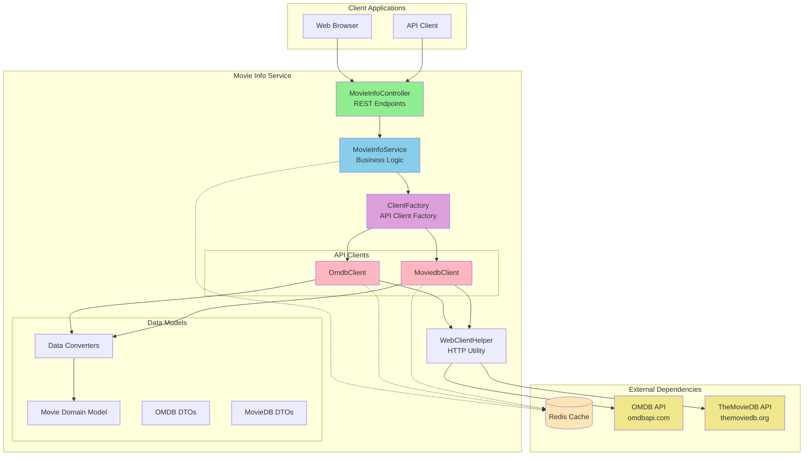
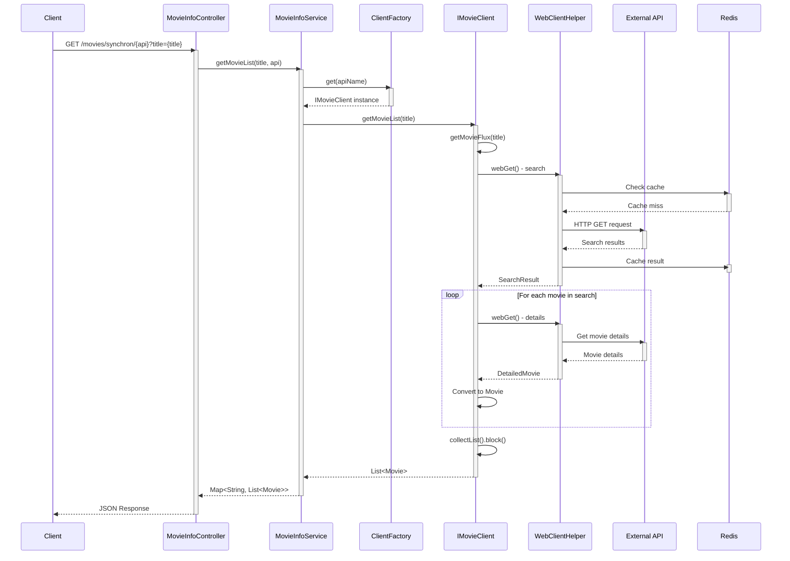
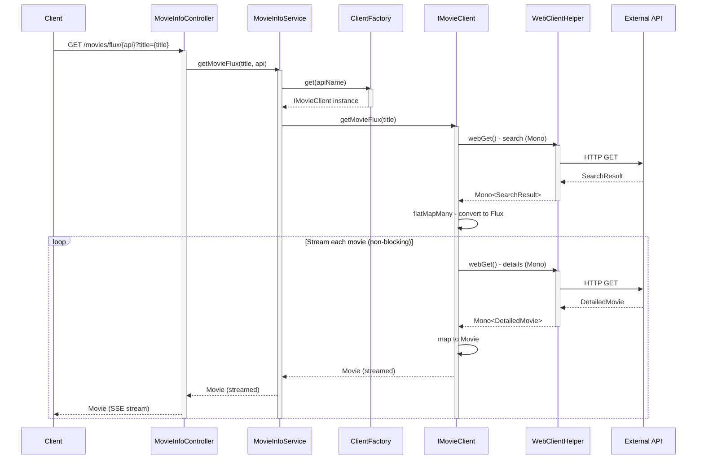
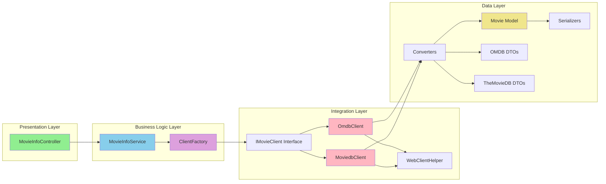
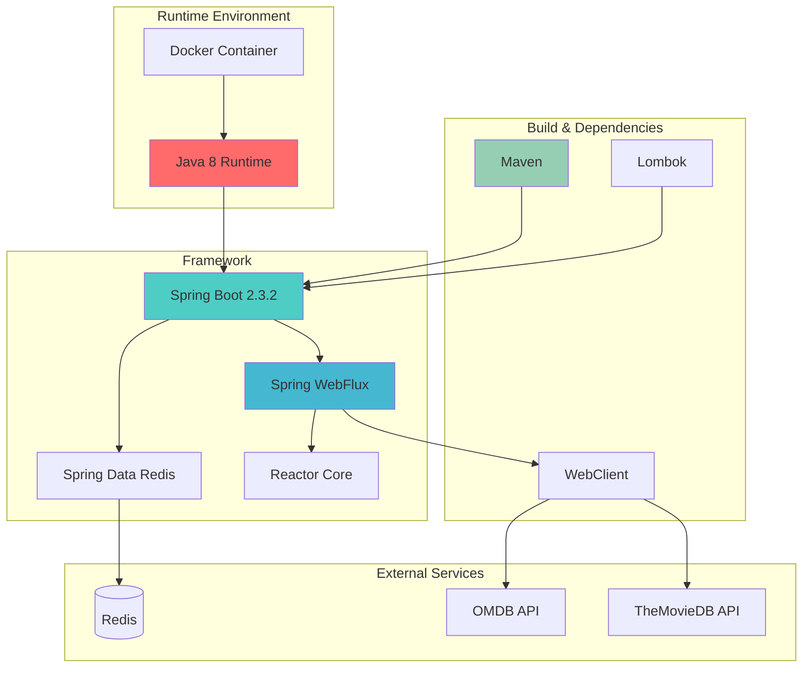
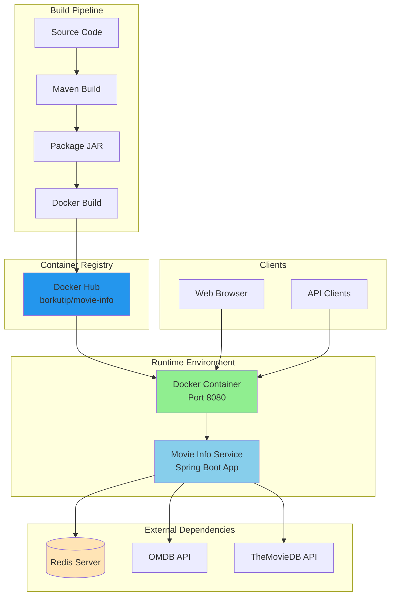
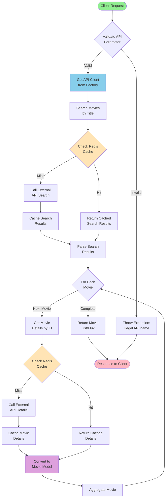
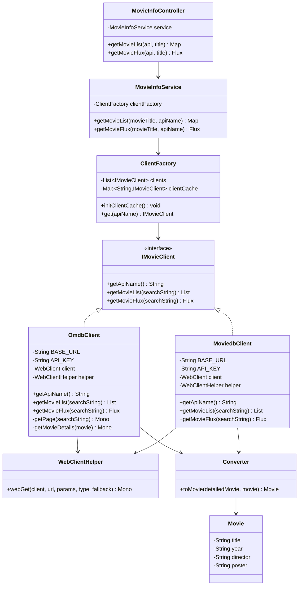
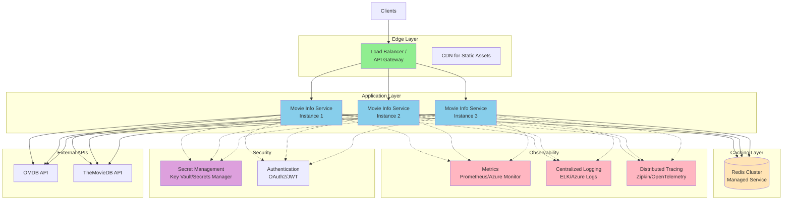

# Movie Info Service - Architecture Diagram

## System Architecture Overview

This document provides visual representations of the Movie Info Service architecture using Mermaid diagrams.

## High-Level System Architecture

## Request Flow - Synchronous Mode

## Request Flow - Reactive (Flux) Mode

## Component Architecture

## Technology Stack Diagram

## Deployment Architecture

## Data Flow - Movie Search

## Class Relationship Diagram

## Future State Architecture (Cloud Native)

## Notes

All diagrams are created using Mermaid syntax and can be rendered by:
- GitHub (native support)
- Mermaid Live Editor (https://mermaid.live)
- VS Code with Mermaid extension
- Documentation tools that support Mermaid

### Diagram Descriptions

1. **High-Level System Architecture**: Shows the overall system components and their relationships
2. **Request Flow - Synchronous Mode**: Sequence diagram for blocking API calls
3. **Request Flow - Reactive (Flux) Mode**: Sequence diagram for non-blocking streaming responses
4. **Component Architecture**: Layered architecture with component dependencies
5. **Technology Stack Diagram**: Technology dependencies and relationships
6. **Deployment Architecture**: Current deployment setup with Docker
7. **Data Flow - Movie Search**: Flowchart showing the movie search process with caching
8. **Class Relationship Diagram**: UML-style class diagram showing relationships
9. **Future State Architecture**: Proposed cloud-native architecture with scalability and observability

### Key Architectural Patterns

- **Layered Architecture**: Clear separation between presentation, business, and data layers
- **Factory Pattern**: ClientFactory for creating API clients
- **Strategy Pattern**: IMovieClient interface with multiple implementations
- **Reactive Programming**: Non-blocking I/O with Project Reactor
- **Repository Pattern**: (Implied) for data access through Redis
- **Adapter Pattern**: Converters to adapt external API models to internal domain models
