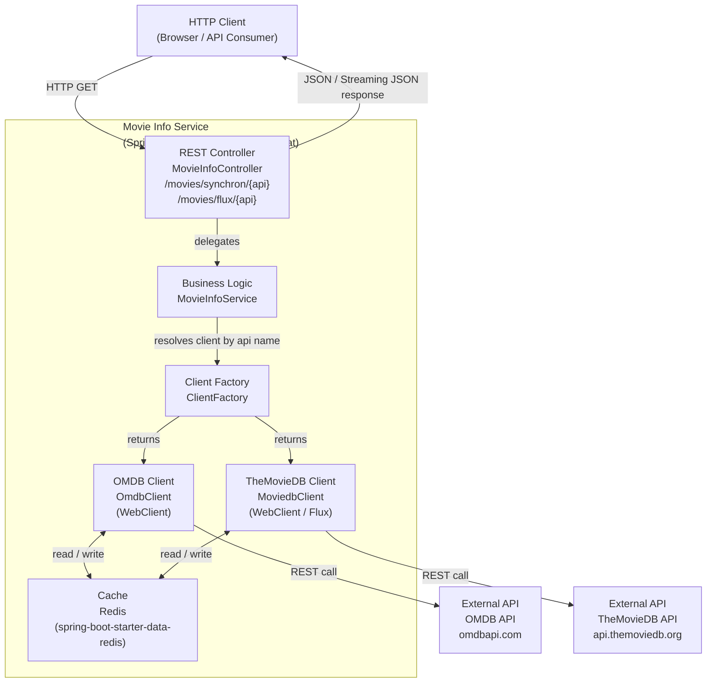

# Architecture Diagram

This diagram illustrates the high-level architecture of the Movie Info Service, a Spring Boot application that aggregates movie data from external APIs and serves it via a reactive REST interface.

## Application Architecture

```mermaid
flowchart TD
    Client["HTTP Client\n(Browser / API Consumer)"]

    subgraph App["Movie Info Service\n(Spring Boot 3.2.5 · Java 17 · Tomcat)"]
        Controller["REST Controller\nMovieInfoController\n/movies/synchron/{api}\n/movies/flux/{api}"]
        Service["Business Logic\nMovieInfoService"]
        Factory["Client Factory\nClientFactory"]
        OmdbClient["OMDB Client\nOmdbClient\n(WebClient)"]
        MoviedbClient["TheMovieDB Client\nMoviedbClient\n(WebClient / Flux)"]
        Redis["Cache\nRedis\n(spring-boot-starter-data-redis)"]
    end

    OmdbAPI["External API\nOMDB API\nomdbapi.com"]
    MoviedbAPI["External API\nTheMovieDB API\napi.themoviedb.org"]

    Client -->|"HTTP GET"| Controller
    Controller -->|"delegates"| Service
    Service -->|"resolves client by api name"| Factory
    Factory -->|"returns"| OmdbClient
    Factory -->|"returns"| MoviedbClient
    OmdbClient <-->|"read / write"| Redis
    MoviedbClient <-->|"read / write"| Redis
    OmdbClient -->|"REST call"| OmdbAPI
    MoviedbClient -->|"REST call"| MoviedbAPI
    Controller -->|"JSON / Streaming JSON response"| Client
```
