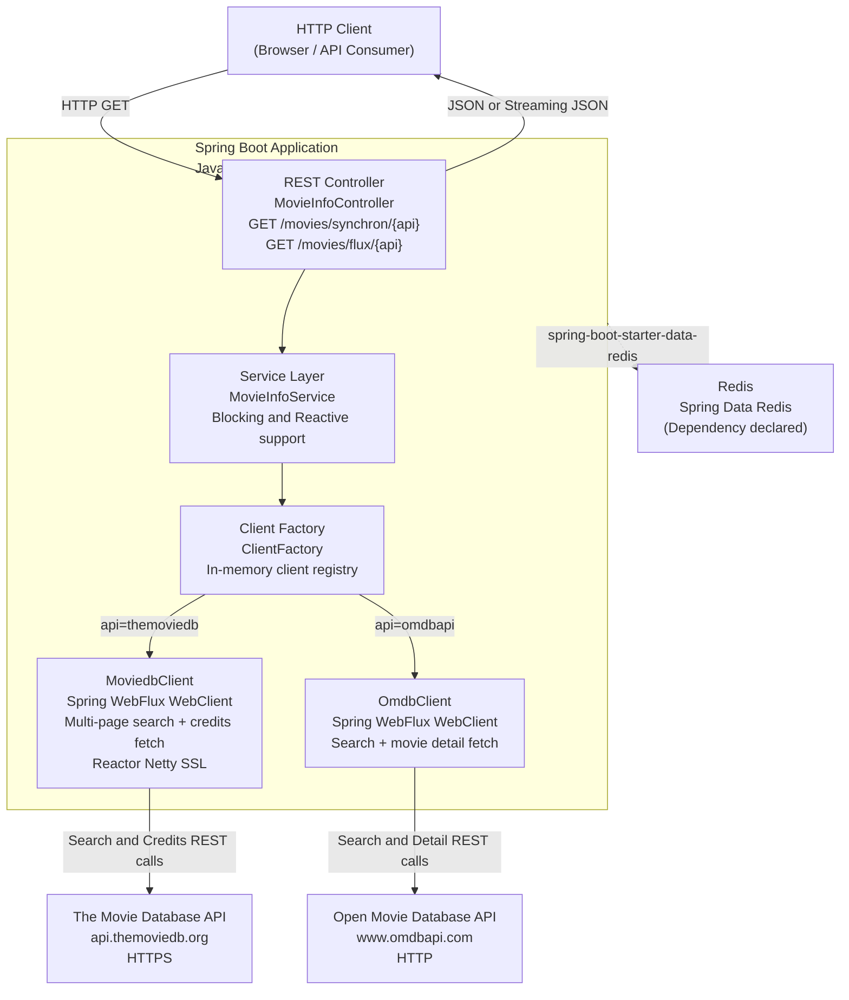

# Architecture Diagram

This diagram represents the high-level architecture of the `movie-info-service`, a Spring Boot REST API that aggregates movie information from multiple external data sources.

## Application Architecture

```mermaid
flowchart TD
    Client["HTTP Client\n(Browser / API Consumer)"]

    subgraph App["Spring Boot Application\nJava 17 · Spring Boot 3.2.5 · Tomcat"]
        Controller["REST Controller\nMovieInfoController\nGET /movies/synchron/{api}\nGET /movies/flux/{api}"]
        Service["Service Layer\nMovieInfoService\nBlocking and Reactive support"]
        Factory["Client Factory\nClientFactory\nIn-memory client registry"]
        MoviedbClient["MoviedbClient\nSpring WebFlux WebClient\nMulti-page search + credits fetch\nReactor Netty SSL"]
        OmdbClient["OmdbClient\nSpring WebFlux WebClient\nSearch + movie detail fetch"]
    end

    Redis["Redis\nSpring Data Redis\n(Dependency declared)"]

    MovieDB["The Movie Database API\napi.themoviedb.org\nHTTPS"]
    OMDB["Open Movie Database API\nwww.omdbapi.com\nHTTP"]

    Client -->|"HTTP GET"| Controller
    Controller --> Service
    Service --> Factory
    Factory -->|"api=themoviedb"| MoviedbClient
    Factory -->|"api=omdbapi"| OmdbClient
    App -. "spring-boot-starter-data-redis" .-> Redis
    MoviedbClient -->|"Search and Credits REST calls"| MovieDB
    OmdbClient -->|"Search and Detail REST calls"| OMDB
    Controller -->|"JSON or Streaming JSON"| Client
```
