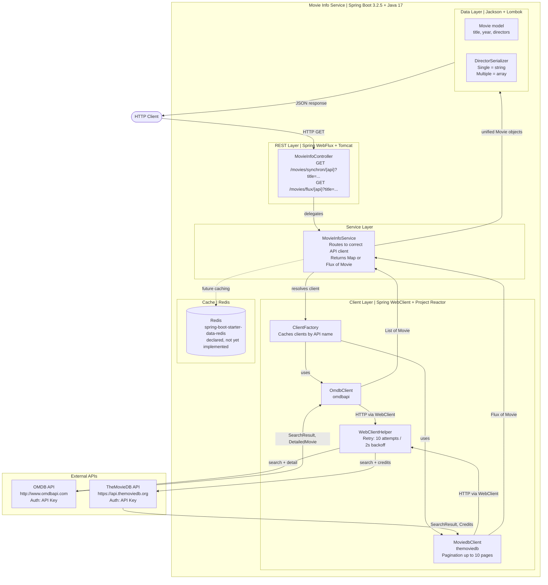

# Architecture Diagram

Movie Info Service is a Spring Boot 3.2.5 reactive REST API (Java 17) that aggregates movie data from multiple external providers and returns unified results via synchronous or streaming endpoints.

## Application Architecture

```mermaid
flowchart TD
    Client(["HTTP Client"])

    subgraph App["Movie Info Service  |  Spring Boot 3.2.5 + Java 17"]
        direction TB

        subgraph Controller["REST Layer  |  Spring WebFlux + Tomcat"]
            C["MovieInfoController
            GET /movies/synchron/{api}?title=...
            GET /movies/flux/{api}?title=..."]
        end

        subgraph Service["Service Layer"]
            S["MovieInfoService
            Routes to correct API client
            Returns Map or Flux of Movie"]
        end

        subgraph Clients["Client Layer  |  Spring WebClient + Project Reactor"]
            CF["ClientFactory
            Caches clients by API name"]
            WCH["WebClientHelper
            Retry: 10 attempts / 2s backoff"]
            OC["OmdbClient
            omdbapi"]
            MC["MoviedbClient
            themoviedb
            Pagination up to 10 pages"]
        end

        subgraph Data["Data Layer  |  Jackson + Lombok"]
            M["Movie model
            title, year, directors"]
            DS["DirectorSerializer
            Single = string
            Multiple = array"]
        end

        subgraph Cache["Cache  |  Redis"]
            R[("Redis
            spring-boot-starter-data-redis
            declared, not yet implemented")]
        end
    end

    subgraph External["External APIs"]
        OMDB["OMDB API
        http://www.omdbapi.com
        Auth: API Key"]
        TMDB["TheMovieDB API
        https://api.themoviedb.org
        Auth: API Key"]
    end

    Client -->|"HTTP GET"| C
    C -->|"delegates"| S
    S -->|"resolves client"| CF
    CF -->|"uses"| OC
    CF -->|"uses"| MC
    OC -->|"HTTP via WebClient"| WCH
    MC -->|"HTTP via WebClient"| WCH
    WCH -->|"search + detail"| OMDB
    WCH -->|"search + credits"| TMDB
    OMDB -->|"SearchResult, DetailedMovie"| OC
    TMDB -->|"SearchResult, Credits"| MC
    OC -->|"List of Movie"| S
    MC -->|"Flux of Movie"| S
    S -->|"unified Movie objects"| Data
    Data -->|"JSON response"| Client
    S -.->|"future caching"| R
```
