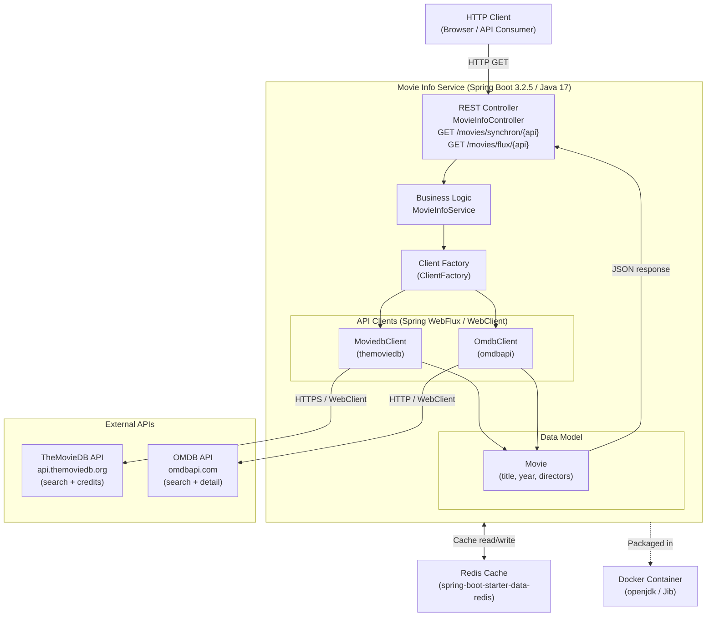

# Architecture Diagram

This diagram illustrates the high-level architecture of the Movie Info Service, a Spring Boot REST application that aggregates movie data from multiple external APIs with Redis caching.

## Application Architecture

```mermaid
flowchart TD
    Client["HTTP Client\n(Browser / API Consumer)"]

    subgraph App["Movie Info Service (Spring Boot 3.2.5 / Java 17)"]
        Controller["REST Controller\nMovieInfoController\nGET /movies/synchron/{api}\nGET /movies/flux/{api}"]
        Service["Business Logic\nMovieInfoService"]
        Factory["Client Factory\n(ClientFactory)"]

        subgraph Clients["API Clients (Spring WebFlux / WebClient)"]
            MoviedbClient["MoviedbClient\n(themoviedb)"]
            OmdbClient["OmdbClient\n(omdbapi)"]
        end

        subgraph DataModel["Data Model"]
            Movie["Movie\n(title, year, directors)"]
        end
    end

    subgraph ExternalAPIs["External APIs"]
        TheMovieDB["TheMovieDB API\napi.themoviedb.org\n(search + credits)"]
        OMDB["OMDB API\nomdbapi.com\n(search + detail)"]
    end

    Cache["Redis Cache\n(spring-boot-starter-data-redis)"]

    Container["Docker Container\n(openjdk / Jib)"]

    Client -->|"HTTP GET"| Controller
    Controller --> Service
    Service --> Factory
    Factory --> MoviedbClient
    Factory --> OmdbClient
    MoviedbClient -->|"HTTPS / WebClient"| TheMovieDB
    OmdbClient -->|"HTTP / WebClient"| OMDB
    MoviedbClient --> Movie
    OmdbClient --> Movie
    Movie -->|"JSON response"| Controller
    App <-->|"Cache read/write"| Cache
    App -.->|"Packaged in"| Container
```
