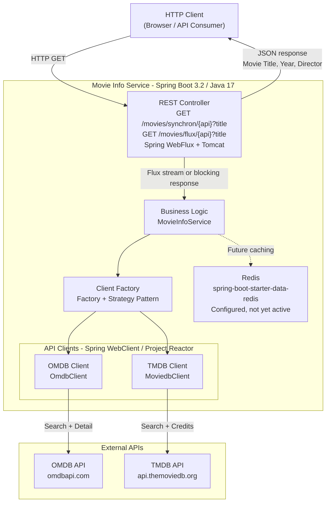

# Architecture Diagram

This diagram represents the high-level architecture of the Movie Info Service, a reactive Spring Boot microservice that aggregates movie data from external APIs.

## Application Architecture

```mermaid
flowchart TD
    Client["HTTP Client\n(Browser / API Consumer)"]

    subgraph App["Movie Info Service - Spring Boot 3.2 / Java 17"]
        Controller["REST Controller\nGET /movies/synchron/{api}?title\nGET /movies/flux/{api}?title\nSpring WebFlux + Tomcat"]
        Service["Business Logic\nMovieInfoService"]
        Factory["Client Factory\nFactory + Strategy Pattern"]

        subgraph Clients["API Clients - Spring WebClient / Project Reactor"]
            OmdbClient["OMDB Client\nOmdbClient"]
            TmdbClient["TMDB Client\nMoviedbClient"]
        end

        Redis["Redis\nspring-boot-starter-data-redis\nConfigured, not yet active"]
    end

    subgraph External["External APIs"]
        OMDB["OMDB API\nomdbapi.com"]
        TMDB["TMDB API\napi.themoviedb.org"]
    end

    Client -->|"HTTP GET"| Controller
    Controller -->|"Flux stream or blocking response"| Service
    Service --> Factory
    Factory --> OmdbClient
    Factory --> TmdbClient
    OmdbClient -->|"Search + Detail"| OMDB
    TmdbClient -->|"Search + Credits"| TMDB
    Service -.->|"Future caching"| Redis
    Controller -->|"JSON response\nMovie Title, Year, Director"| Client
```
