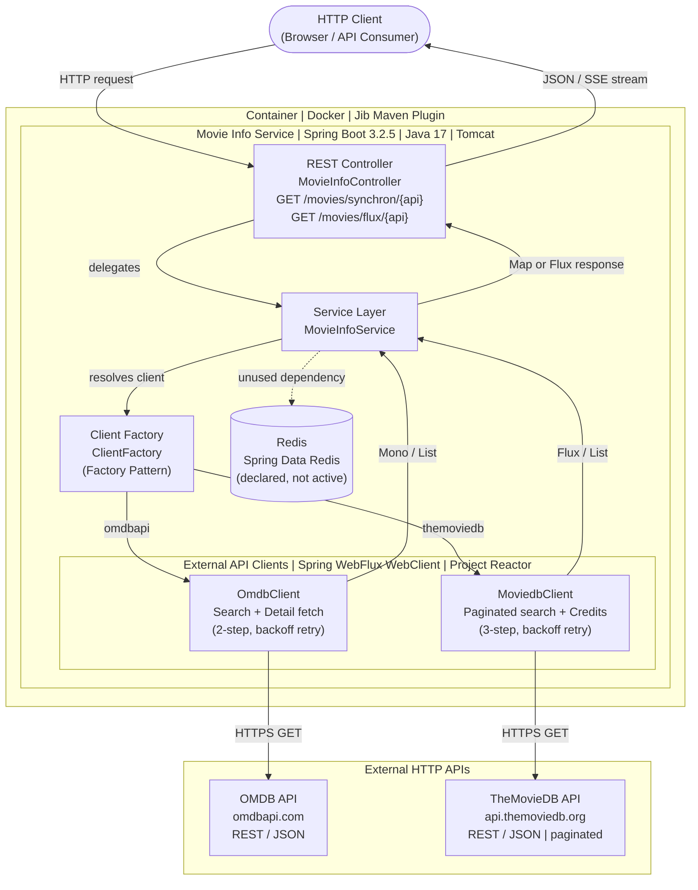

# Architecture Diagram

This diagram shows the high-level architecture of the Movie Info Service — a Spring Boot application that exposes REST endpoints for querying movie data from external APIs.

## Application Architecture

```mermaid
flowchart TD
    Client(["HTTP Client\n(Browser / API Consumer)"])

    subgraph App["Movie Info Service  |  Spring Boot 3.2.5  |  Java 17  |  Tomcat"]
        Controller["REST Controller\nMovieInfoController\nGET /movies/synchron/{api}\nGET /movies/flux/{api}"]
        Service["Service Layer\nMovieInfoService"]
        Factory["Client Factory\nClientFactory\n(Factory Pattern)"]

        subgraph Clients["External API Clients  |  Spring WebFlux WebClient  |  Project Reactor"]
            OmdbClient["OmdbClient\nSearch + Detail fetch\n(2-step, backoff retry)"]
            MoviedbClient["MoviedbClient\nPaginated search + Credits\n(3-step, backoff retry)"]
        end

        Redis[("Redis\nSpring Data Redis\n(declared, not active)")]
    end

    subgraph External["External HTTP APIs"]
        OMDB["OMDB API\nomdbapi.com\nREST / JSON"]
        TMDB["TheMovieDB API\napi.themoviedb.org\nREST / JSON  |  paginated"]
    end

    subgraph Container["Container  |  Docker  |  Jib Maven Plugin"]
        App
    end

    Client -- "HTTP request" --> Controller
    Controller -- "delegates" --> Service
    Service -- "resolves client" --> Factory
    Factory -- "omdbapi" --> OmdbClient
    Factory -- "themoviedb" --> MoviedbClient
    OmdbClient -- "Mono / List" --> Service
    MoviedbClient -- "Flux / List" --> Service
    Service -- "Map or Flux response" --> Controller
    Controller -- "JSON / SSE stream" --> Client
    OmdbClient -- "HTTPS GET" --> OMDB
    MoviedbClient -- "HTTPS GET" --> TMDB
    Service -. "unused dependency" .-> Redis
```
