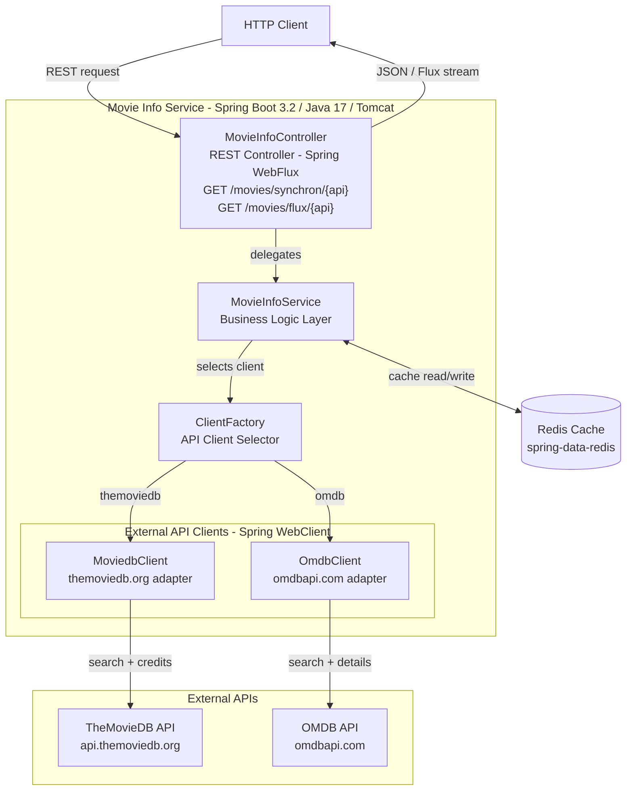

# Architecture Diagram

This diagram shows the high-level architecture of the Movie Info Service, a Spring Boot application that aggregates movie data from multiple external APIs and serves it via a reactive REST interface backed by Redis caching.

## Application Architecture

```mermaid
flowchart TD
    Client["HTTP Client"]

    subgraph App["Movie Info Service - Spring Boot 3.2 / Java 17 / Tomcat"]
        Controller["MovieInfoController\nREST Controller - Spring WebFlux\nGET /movies/synchron/{api}\nGET /movies/flux/{api}"]
        Service["MovieInfoService\nBusiness Logic Layer"]
        Factory["ClientFactory\nAPI Client Selector"]

        subgraph Clients["External API Clients - Spring WebClient"]
            MoviedbClient["MoviedbClient\nthemoviedb.org adapter"]
            OmdbClient["OmdbClient\nomdbapi.com adapter"]
        end
    end

    Redis[("Redis Cache\nspring-data-redis")]

    subgraph ExternalAPIs["External APIs"]
        TheMovieDB["TheMovieDB API\napi.themoviedb.org"]
        OMDB["OMDB API\nomdbapi.com"]
    end

    Client -->|"REST request"| Controller
    Controller -->|"delegates"| Service
    Service -->|"selects client"| Factory
    Factory -->|"themoviedb"| MoviedbClient
    Factory -->|"omdb"| OmdbClient
    Service <-->|"cache read/write"| Redis
    MoviedbClient -->|"search + credits"| TheMovieDB
    OmdbClient -->|"search + details"| OMDB
    Controller -->|"JSON / Flux stream"| Client
```
