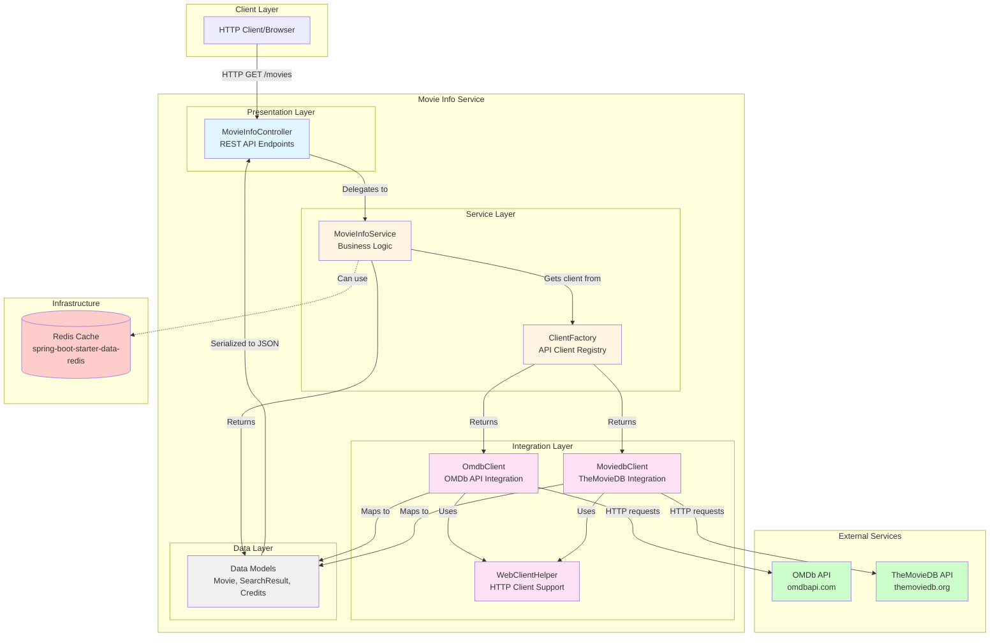

# Movie Info Service - Architecture Diagram

This diagram illustrates the high-level architecture of the Movie Info Service application based on the assessment analysis.

## Architecture Overview

## Technology Stack

| Layer | Technologies |
|-------|-------------|
| **Framework** | Spring Boot 2.3.2.RELEASE |
| **Java Version** | Java 8 (1.8) |
| **Web Framework** | Spring WebFlux (Reactive) |
| **HTTP Client** | WebClient (Reactive) |
| **Server** | Apache Tomcat (Embedded) |
| **Caching** | Spring Data Redis |
| **Build Tool** | Maven |
| **Data Serialization** | Jackson (JSON) |
| **Logging** | Logback with SLF4J |

## Key Components

### 1. REST API Layer
- **MovieInfoController**: Exposes REST endpoints for movie searches
  - `/movies/synchron/{api}`: Synchronous movie list endpoint
  - `/movies/flux/{api}`: Reactive streaming endpoint
  - Supports both OMDb and TheMovieDB APIs

### 2. Service Layer
- **MovieInfoService**: Orchestrates business logic and API selection
- **ClientFactory**: Factory pattern for API client selection and management

### 3. Integration Layer
- **OmdbClient**: Integration with OMDb API
  - Searches movies by title
  - Retrieves detailed movie information
- **MoviedbClient**: Integration with TheMovieDB API
  - Paginated search results
  - Credits and director information
- **WebClientHelper**: Shared HTTP client utilities

### 4. Data Layer
- **Domain Models**: Movie, SearchResult, Credits, DirectorSerializer
- **Redis**: Configured for caching (spring-boot-starter-data-redis)

## External Dependencies

### Third-Party APIs
1. **OMDb API** (omdbapi.com)
   - Movie database and search
   - API Key: Configured in application.properties

2. **TheMovieDB API** (themoviedb.org)
   - Alternative movie database
   - Provides credits and director information
   - API Key: Configured in application.properties

### Infrastructure Services
1. **Redis Cache**
   - Dependency: spring-boot-starter-data-redis
   - Purpose: Response caching and performance optimization

## Data Flow

1. **Request Flow**:
   - Client sends HTTP GET request to `/movies/synchron/{api}` or `/movies/flux/{api}`
   - Controller receives request with movie title and API selection
   - Controller delegates to MovieInfoService
   - Service uses ClientFactory to get appropriate API client
   - Client makes HTTP requests to external API (OMDb or TheMovieDB)
   - Response data is mapped to domain models
   - JSON response returned to client

2. **API Integration Pattern**:
   - Strategy pattern for multiple API backends
   - Factory pattern for client instantiation
   - Reactive programming with WebFlux
   - Both synchronous and streaming response modes

## Architecture Characteristics

- **Pattern**: Layered architecture with clear separation of concerns
- **Style**: RESTful web service
- **Communication**: Synchronous HTTP and reactive streaming
- **External Integration**: Multiple third-party movie APIs
- **Scalability**: Redis caching support, reactive programming model
- **Flexibility**: Pluggable API clients through factory pattern

## Assessment Insights

Based on the AppCAT assessment report:
- **Total Issues**: 10 issues identified (23 incidents, 77 story points)
- **Key Concerns**:
  - Spring Boot 2.3.2 requires upgrade to modern version
  - Java 8 requires upgrade to LTS version (11, 17, or 21)
  - Deprecated APIs need replacement
  - Security concerns with hardcoded API keys
  - Redis configuration for cloud deployment

## Modernization Recommendations

1. **Framework Upgrade**: Migrate to Spring Boot 3.x
2. **Java Version**: Upgrade to Java 17 or 21 (LTS)
3. **Configuration Management**: Move API keys to environment variables or Azure Key Vault
4. **Container Readiness**: Prepare for Azure Kubernetes Service (AKS), App Service, or Container Apps
5. **Cache Strategy**: Configure Redis for Azure Cache for Redis
6. **Security**: Implement managed identities for Azure service authentication
