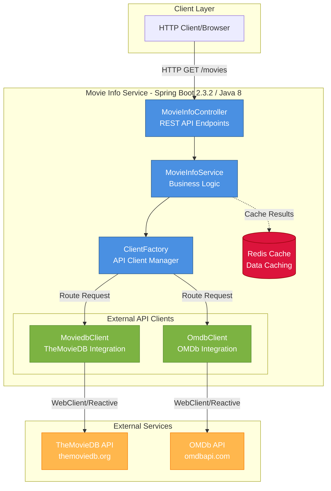

# Movie Info Service - Architecture Diagram

This diagram represents the high-level architecture of the Movie Info Service application based on the assessment results.

## Application Architecture

## Architecture Overview

### Technology Stack

- **Framework**: Spring Boot 2.3.2 (Legacy Version - Upgrade Recommended)
- **Language**: Java 1.8 (Legacy Version - Upgrade Recommended)
- **Reactive Programming**: Spring WebFlux with Reactor
- **Build Tool**: Maven
- **Caching**: Redis
- **HTTP Client**: WebClient (Reactive)
- **Container**: Docker (openjdk:8-jdk-alpine base image - deprecated)

### Application Layers

#### 1. **REST API Layer**
- **MovieInfoController**: Exposes REST endpoints for movie searches
  - `/movies/synchron/{api}`: Synchronous endpoint returning complete movie list
  - `/movies/flux/{api}`: Reactive endpoint streaming movies as they're fetched
  - Supports both TheMovieDB and OMDb API backends

#### 2. **Service Layer**
- **MovieInfoService**: Business logic orchestration
  - Manages movie search operations
  - Coordinates with API clients through factory pattern
  - Supports both synchronous and reactive data flows

#### 3. **Client Layer**
- **ClientFactory**: Factory pattern for API client selection
  - Routes requests to appropriate external API client
  - Supports runtime selection between TheMovieDB and OMDb
- **MoviedbClient**: Integration with TheMovieDB API
  - Searches movies by title
  - Fetches director information via credits endpoint
  - Handles pagination for large result sets
- **OmdbClient**: Integration with OMDb API
  - Searches movies by title
  - Fetches detailed movie information

#### 4. **Data Storage**
- **Redis**: In-memory cache for movie data
  - Reduces API calls to external services
  - Improves response times for repeated queries

### External Dependencies

1. **TheMovieDB API** (api.themoviedb.org)
   - Primary movie database
   - Provides comprehensive movie data
   - API key configured in application.properties

2. **OMDb API** (www.omdbapi.com)
   - Alternative movie database
   - Provides detailed movie information
   - API key configured in application.properties

### Key Findings from Assessment

The assessment identified **10 issues** across **23 incidents** with the following categories:

- **Framework Upgrade** (7 incidents): Spring Boot 2.3.2 is outdated
- **Remote Communication** (7 incidents): External API integration concerns
- **Deprecated APIs** (5 incidents): Using deprecated components
- **Java Version Upgrade** (1 incident): Java 8 is outdated
- **Local Resource Access** (2 incidents): File system and configuration concerns
- **Cache Service Migration** (1 incident): Redis configuration for Azure

**Severity Distribution**:
- Mandatory: 19 incidents
- Optional: 4 incidents

**Total Effort Estimate**: 77 story points

### Modernization Recommendations

Based on the assessment, the following modernization efforts are recommended:

1. **Upgrade Java**: Migrate from Java 8 to Java 17 or 21 (LTS versions)
2. **Upgrade Spring Boot**: Migrate from 2.3.2 to 3.x (latest stable)
3. **Update Base Image**: Replace deprecated openjdk:8-jdk-alpine with modern base image
4. **Secure API Keys**: Move hardcoded API keys to Azure Key Vault or environment variables
5. **Azure Cache for Redis**: Migrate Redis configuration for Azure managed service
6. **Deprecated API Cleanup**: Replace deprecated Spring components with modern alternatives

### Data Flow

1. Client sends HTTP request to REST API endpoints
2. Controller receives request and delegates to Service layer
3. Service uses Factory to select appropriate API client (MovieDB or OMDB)
4. Client makes reactive HTTP call to external API
5. Results are processed and optionally cached in Redis
6. Response is returned to client (synchronously or as reactive stream)

## Next Steps

1. Review the assessment report at `.github/modernize/report.json` for detailed issue analysis
2. Prioritize modernization tasks based on severity and effort estimates
3. Create modernization plan for Azure migration (AKS, App Service, or Container Apps)
4. Address security concerns (API key management)
5. Plan framework and runtime upgrades
