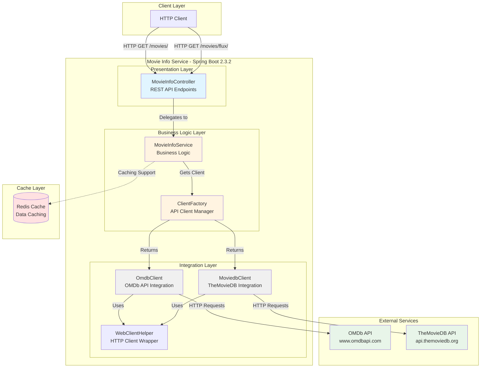

# Movie Info Service - Architecture Diagram

## Application Overview

The Movie Info Service is a Spring Boot reactive web application that aggregates movie information from multiple external APIs (OMDb and TheMovieDB) and provides both synchronous and streaming endpoints.

## Architecture Diagram

## Technology Stack

### Core Framework
- **Spring Boot**: 2.3.2.RELEASE
- **Java**: 1.8
- **Build Tool**: Maven

### Key Dependencies
- **Spring WebFlux**: Reactive web framework with Tomcat
- **Spring Data Redis**: Redis integration for caching
- **Project Lombok**: Code generation
- **Reactor**: Reactive programming support

### Deployment
- **Containerization**: Docker support
- **Base Image**: openjdk:8-jdk-alpine

## Application Layers

### 1. Presentation Layer
- **MovieInfoController**: REST API controller
  - `/movies/synchron/{api}`: Synchronous endpoint returning JSON
  - `/movies/flux/{api}`: Streaming endpoint using Server-Sent Events

### 2. Business Logic Layer
- **MovieInfoService**: Core business logic service
- **ClientFactory**: Factory pattern for managing API clients

### 3. Integration Layer
- **OmdbClient**: Integration with OMDb API
- **MoviedbClient**: Integration with TheMovieDB API
- **WebClientHelper**: Shared HTTP client functionality

### 4. Data Layer
- **Redis**: Caching layer for performance optimization
- **Data Models**: Movie, SearchResult, Credits, etc.

## External Dependencies

### Third-Party APIs
1. **OMDb API** (www.omdbapi.com)
   - Movie database and search
   - API Key: Configured in application.properties

2. **TheMovieDB API** (api.themoviedb.org)
   - Alternative movie database
   - API Key: Configured in application.properties

### Data Storage
- **Redis**: Used for caching movie information

## Key Features

- **Reactive Programming**: Uses Spring WebFlux for non-blocking operations
- **Multiple API Support**: Aggregates data from OMDb and TheMovieDB
- **Dual Response Types**: 
  - Synchronous JSON responses
  - Streaming responses with Flux
- **Caching**: Redis integration for performance
- **Containerized**: Docker support for easy deployment

## Configuration

Configuration is managed through `application.properties`:
- API keys for external services
- Base URLs for OMDb and TheMovieDB
- Logging configuration
- Redis connection settings

## Notes

- Application uses Spring Boot starter parent 2.3.2
- Java version is 1.8
- WebFlux is configured to use Tomcat instead of Netty for blocking operations
- Project uses Lombok for reducing boilerplate code
