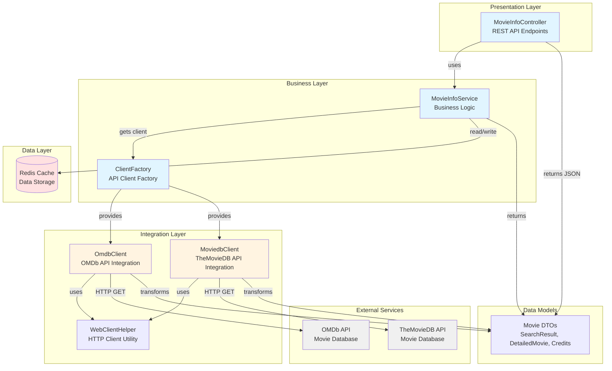

# Movie Info Service - Architecture Diagram

## Application Overview

Movie Info Service is a Spring Boot 2.3.2 application built with Java 8 that provides RESTful APIs to search and retrieve movie information from external movie databases (OMDb and TheMovieDB). The application uses reactive programming with WebFlux and includes Redis caching for performance optimization.

## Architecture Diagram

## Technology Stack

### Core Framework
- **Spring Boot**: 2.3.2.RELEASE
- **Java Version**: 1.8 (Java 8)
- **Build Tool**: Maven

### Key Dependencies
- **Spring WebFlux**: Reactive web framework (with Tomcat instead of Netty)
- **Spring Data Redis**: Redis integration for caching
- **Project Reactor**: Reactive programming support
- **Lombok**: Boilerplate code reduction

### Data Storage
- **Redis**: Caching layer for improved performance

### External Integrations
- **OMDb API**: Open Movie Database API for movie information
- **TheMovieDB API**: The Movie Database API for movie information

## Application Layers

### 1. Presentation Layer (Controller)
- **MovieInfoController**: REST controller exposing movie search endpoints
  - `/movies/synchron/{api}`: Synchronous movie search
  - `/movies/flux/{api}`: Streaming movie search using reactive Flux

### 2. Business Layer (Service)
- **MovieInfoService**: Core business logic for movie operations
- **ClientFactory**: Factory pattern for managing API clients

### 3. Integration Layer (Clients)
- **OmdbClient**: Integration with OMDb API
- **MoviedbClient**: Integration with TheMovieDB API
- **WebClientHelper**: Shared HTTP client utilities

### 4. Data Layer
- **Redis**: Caching infrastructure
- **DTOs**: Data transfer objects for different APIs (omdb, moviedb packages)

## Data Flow

1. **Client Request**: HTTP request arrives at MovieInfoController
2. **Service Processing**: MovieInfoService processes the request
3. **Client Selection**: ClientFactory provides the appropriate API client (OMDb or TheMovieDB)
4. **Cache Check**: Service checks Redis cache for existing data
5. **External API Call**: If cache miss, client calls external movie API
6. **Data Transformation**: Client transforms API response to internal Movie model
7. **Cache Update**: Service updates Redis cache with new data
8. **Response**: Controller returns movie data as JSON

## Key Features

- **Reactive Programming**: Uses Spring WebFlux with Reactor for non-blocking operations
- **Multiple Data Sources**: Supports both OMDb and TheMovieDB APIs
- **Caching Strategy**: Redis-based caching for performance optimization
- **Factory Pattern**: Flexible API client management
- **RESTful API**: Clean REST endpoints with JSON responses
- **Stream Support**: Supports both synchronous and streaming responses

## Configuration

Key configuration properties in `application.properties`:
- OMDb API key and base URL
- TheMovieDB API key and base URL
- Logging configuration for debugging
- Maximum pages for TheMovieDB searches

## Assessment Metadata

- **Analysis Date**: February 11, 2026
- **Analysis Tool**: Java AppCAT CLI v1.0.0
- **Target Platforms**: Azure AKS, Azure App Service, Azure Container Apps
- **Total Issues Identified**: 10 issues (23 incidents, 77 story points)

## Key Modernization Opportunities

Based on the assessment, the main areas for modernization include:
1. **Java Version Upgrade**: Current Java 8 → Target Java 11/17/21
2. **Spring Boot Upgrade**: Current 2.3.2 → Target 3.x
3. **Deprecated APIs**: Update deprecated Spring and Java APIs
4. **Security**: Address hardcoded API keys in configuration
5. **Docker Base Image**: Update from deprecated openjdk:8-jdk-alpine
6. **Cache Migration**: Prepare Redis for Azure Cache for Redis
7. **External Service Configuration**: Externalize API keys to Azure Key Vault
