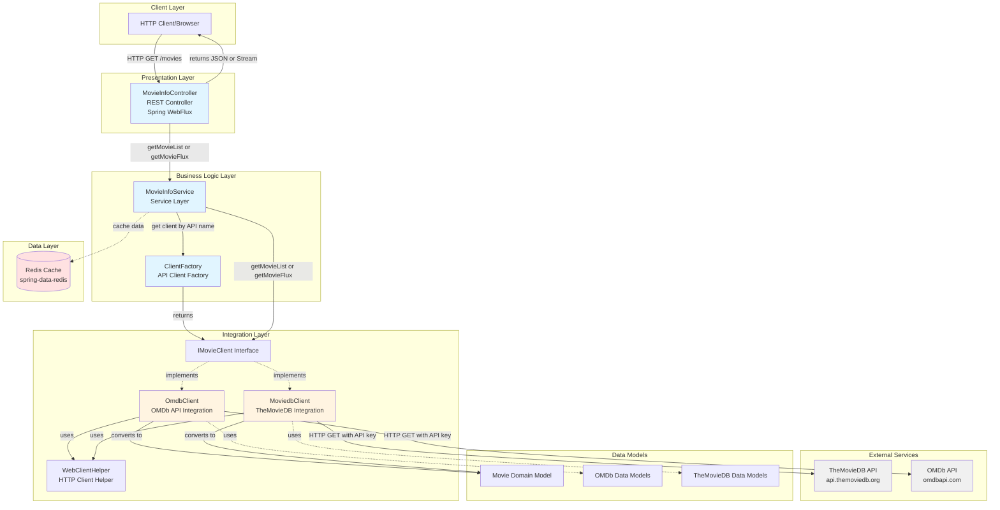

# Movie Info Service - Architecture Diagram

This diagram illustrates the high-level architecture of the Movie Info Service application based on the assessment results.

## Application Overview

**Movie Info Service** is a Spring Boot reactive web application that provides movie information by integrating with multiple external movie APIs (TheMovieDB and OMDb). It uses Redis for caching and supports both synchronous and reactive (streaming) response modes.

## Architecture Diagram

## Architecture Components

### Presentation Layer
- **MovieInfoController**: REST controller that exposes two endpoints:
  - `/movies/synchron/{api}`: Returns movie list as JSON
  - `/movies/flux/{api}`: Returns movie stream using Spring WebFlux reactive streams
- Uses Spring WebFlux for reactive, non-blocking HTTP handling

### Business Logic Layer
- **MovieInfoService**: Main service that orchestrates movie information retrieval
- **ClientFactory**: Factory pattern implementation to dynamically select API client based on the requested API name

### Integration Layer
- **IMovieClient**: Common interface for movie API clients
- **OmdbClient**: Integrates with OMDb API for movie data
- **MoviedbClient**: Integrates with TheMovieDB API for movie data
- **WebClientHelper**: Shared helper for HTTP client operations using Spring WebClient

### Data Layer
- **Redis**: Used for caching movie information (via spring-boot-starter-data-redis)

### External Services
- **TheMovieDB API** (api.themoviedb.org): External movie database service
- **OMDb API** (omdbapi.com): External movie database service

## Technology Stack

| Component | Technology |
|-----------|-----------|
| Framework | Spring Boot 2.3.2.RELEASE |
| Java Version | Java 8 (1.8) |
| Web Framework | Spring WebFlux (Reactive) |
| HTTP Client | Spring WebClient |
| Cache | Redis (spring-boot-starter-data-redis) |
| Server | Tomcat (embedded) |
| Build Tool | Maven |
| Utilities | Lombok |

## Data Flow

1. **Request Flow**:
   - Client sends HTTP GET request to `/movies/synchron/{api}` or `/movies/flux/{api}` with movie title
   - Controller receives request and delegates to MovieInfoService
   - Service uses ClientFactory to get appropriate API client (OmdbClient or MoviedbClient)
   - Client makes HTTP request to external API (OMDb or TheMovieDB)
   - Response is converted to Movie domain model
   - Data is cached in Redis for future requests
   - Response is returned to client as JSON or reactive stream

2. **Reactive vs Synchronous**:
   - Synchronous endpoint: Collects all results and returns as complete JSON
   - Reactive endpoint: Streams results as they become available using Flux

## Key Observations from Assessment

Based on the AppCAT assessment, this application has the following characteristics:

1. **Modern Framework**: Uses Spring Boot with reactive programming (WebFlux)
2. **External Dependencies**: Integrates with two external movie APIs
3. **Caching Strategy**: Leverages Redis for performance optimization
4. **Flexible Design**: Factory pattern allows easy addition of new API clients
5. **Dual Mode Support**: Supports both blocking and non-blocking request patterns

## Migration Considerations

The architecture is well-suited for containerization and cloud deployment with minor modernization:

- **Target Platforms**: Azure Kubernetes Service (AKS), Azure App Service, Azure Container Apps
- **Cache Migration**: Redis can be migrated to Azure Cache for Redis
- **Configuration**: API keys should be moved to Azure Key Vault
- **Monitoring**: Add Azure Application Insights for observability
- **Java Version**: Consider upgrading from Java 8 to Java 17 or 21 LTS

---

*Diagram generated from assessment results on 2026-02-10*
