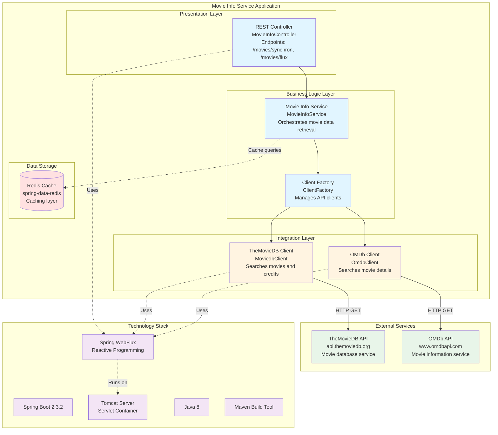

# Movie Info Service - Architecture Diagram

This diagram shows the high-level architecture of the Movie Info Service application based on the assessment analysis.

## Architecture Overview

## Architecture Components

### Presentation Layer
- **MovieInfoController**: REST API endpoints exposing movie search functionality
  - `/movies/synchron/{api}?title={title}` - Synchronous movie search
  - `/movies/flux/{api}?title={title}` - Reactive streaming movie search

### Business Logic Layer
- **MovieInfoService**: Core service orchestrating movie data retrieval
- **ClientFactory**: Factory pattern implementation for managing multiple API clients

### Integration Layer
- **MoviedbClient**: Integration with TheMovieDB API for movie search and credits
- **OmdbClient**: Integration with OMDb API for movie information

### Data Storage
- **Redis**: Caching layer using Spring Data Redis for performance optimization

### External Dependencies
- **TheMovieDB API**: External movie database service (api.themoviedb.org)
- **OMDb API**: External movie information service (www.omdbapi.com)

## Technology Stack

| Component | Technology | Version |
|-----------|-----------|---------|
| Framework | Spring Boot | 2.3.2.RELEASE |
| Language | Java | 1.8 |
| Build Tool | Maven | - |
| Web Framework | Spring WebFlux | Reactive |
| Server | Tomcat | Embedded |
| Cache | Redis | spring-data-redis |
| HTTP Client | WebClient | Reactive |

## Key Patterns

1. **Reactive Programming**: Uses Spring WebFlux for non-blocking, reactive API calls
2. **Factory Pattern**: ClientFactory manages multiple API client implementations
3. **RESTful API**: Exposes standardized REST endpoints for movie searches
4. **Caching Strategy**: Leverages Redis for performance optimization
5. **External Integration**: Integrates with multiple third-party movie APIs

## Data Flow

1. Client makes HTTP request to MovieInfoController
2. Controller delegates to MovieInfoService
3. Service uses ClientFactory to get appropriate API client (TheMovieDB or OMDb)
4. Client makes reactive HTTP calls to external APIs
5. Results are processed and optionally cached in Redis
6. Response returned to client (synchronous or streaming)

## Assessment Notes

- Application uses older versions: Spring Boot 2.3.2 and Java 8
- Reactive programming with WebFlux provides good scalability
- Redis caching improves performance for repeated queries
- Multiple external API dependencies require careful error handling
- API keys are currently in configuration files (security consideration)
