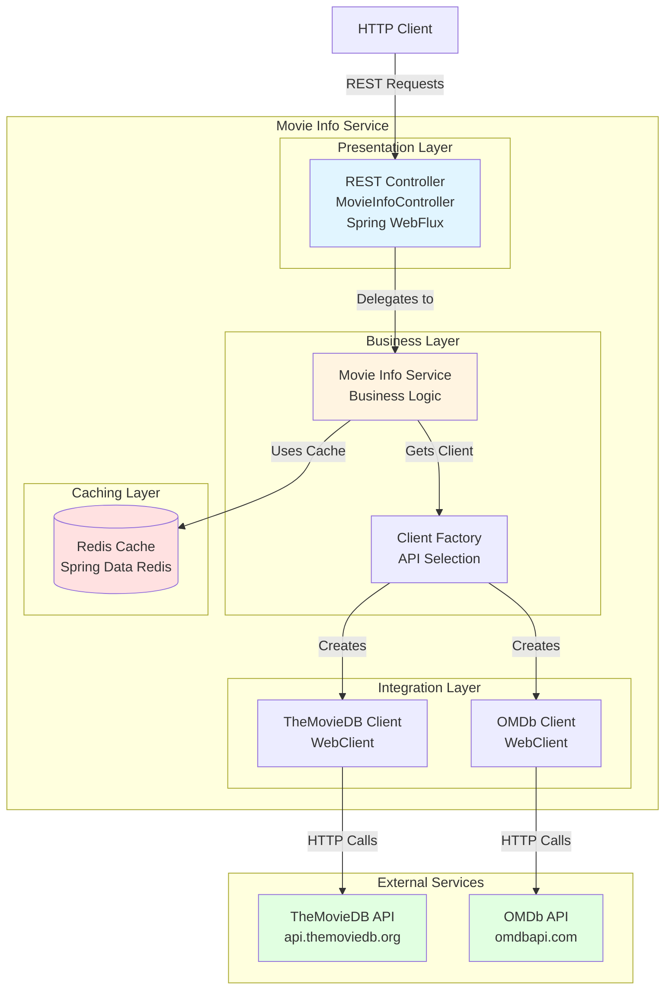

# Movie Info Service - Architecture Diagram

## Overview

This diagram represents the architecture of the Movie Info Service application based on the assessment analysis.

## Architecture Diagram

## Technology Stack

### Framework & Runtime
- **Spring Boot**: 2.3.2.RELEASE
- **Java Version**: 1.8
- **Spring WebFlux**: Reactive web framework with Tomcat (non-blocking I/O)

### Key Dependencies
- **Spring Data Redis**: Caching layer
- **WebClient**: HTTP client for external API calls
- **Lombok**: Code generation and boilerplate reduction
- **Reactor**: Reactive programming support

### External Integrations
- **TheMovieDB API**: Movie database and information service
- **OMDb API**: Open Movie Database service

## Application Layers

### 1. Presentation Layer (Controller)
- **Component**: `MovieInfoController`
- **Responsibilities**:
  - Exposes REST endpoints for movie information
  - Handles HTTP requests and responses
  - Supports both synchronous and reactive (Flux) responses
  - Cross-origin resource sharing (CORS) enabled

### 2. Business Layer (Service)
- **Component**: `MovieInfoService`
- **Responsibilities**:
  - Orchestrates business logic
  - Delegates to appropriate API clients
  - Manages data transformation and aggregation

### 3. Integration Layer (Clients)
- **Components**: `MoviedbClient`, `OmdbClient`, `ClientFactory`
- **Responsibilities**:
  - Communicates with external movie APIs
  - Handles API-specific request/response formats
  - Implements retry and error handling logic
  - Factory pattern for client selection

### 4. Data Access Layer (Cache)
- **Component**: Redis Cache (Spring Data Redis)
- **Responsibilities**:
  - Caches frequently accessed movie data
  - Reduces external API calls
  - Improves response time and performance

## Data Flow

1. **Client Request**: HTTP client sends a request to the REST API
2. **Controller Processing**: Controller receives and validates the request
3. **Service Delegation**: Request is delegated to MovieInfoService
4. **Client Selection**: ClientFactory selects appropriate API client (TheMovieDB or OMDb)
5. **Cache Check**: Service checks Redis cache for existing data
6. **External API Call**: If not cached, client makes HTTP call to external API
7. **Data Transformation**: Response is transformed to internal data model
8. **Cache Update**: Result is cached in Redis
9. **Response**: Data is returned to client (synchronous or reactive stream)

## Key Architectural Patterns

- **Layered Architecture**: Clear separation of concerns (Presentation, Business, Integration, Data)
- **Factory Pattern**: ClientFactory for dynamic client selection
- **Reactive Programming**: WebFlux and Reactor for non-blocking operations
- **Dependency Injection**: Spring-based IoC container
- **API Gateway Pattern**: Single entry point for multiple external services

## Assessment Notes

This architecture diagram was generated from the application assessment. The application demonstrates:
- Modern reactive programming patterns
- Clean separation of concerns
- Integration with multiple external services
- Caching strategy for performance optimization

For detailed assessment findings and recommendations, see `report.json` and `README.md` in this directory.
