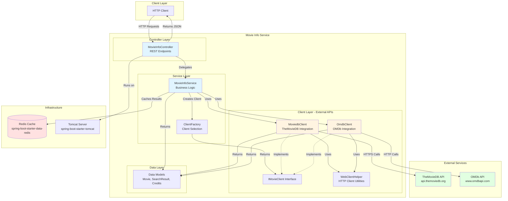

# Movie Info Service - Architecture Diagram

This diagram visualizes the architecture of the Movie Info Service application based on the assessment analysis.

## Architecture Overview

The Movie Info Service is a Spring Boot 2.3.2 application built with Java 8, using a reactive programming model with WebFlux and Tomcat. It provides a REST API to search and retrieve movie information from external movie databases (TheMovieDB and OMDb) with Redis caching.

## Technology Stack

### Core Framework
- **Spring Boot**: 2.3.2.RELEASE
- **Java Version**: 1.8
- **Build Tool**: Maven

### Key Dependencies
- **Spring WebFlux**: Reactive web framework for non-blocking API
- **Spring Data Redis**: Caching layer
- **Tomcat**: Embedded web server (instead of Netty)
- **Project Reactor**: Reactive programming support
- **Lombok**: Code generation for boilerplate reduction

### External Integrations
- **TheMovieDB API**: Primary movie database (HTTPS)
  - Endpoint: `https://api.themoviedb.org`
  - API Key: Configured in application.properties
- **OMDb API**: Alternative movie database (HTTP)
  - Endpoint: `http://www.omdbapi.com`
  - API Key: Configured in application.properties

## Architecture Patterns

### Layered Architecture
1. **Controller Layer**: REST endpoints for movie search
   - Synchronous endpoint: `/movies/synchron/{api}`
   - Reactive streaming endpoint: `/movies/flux/{api}`
   
2. **Service Layer**: Business logic and orchestration
   - Handles movie search operations
   - Coordinates between different API clients
   
3. **Client Layer**: External API integration
   - Implements adapter pattern for multiple APIs
   - Uses WebClient for reactive HTTP calls
   - Manages API-specific data transformation

### Design Patterns
- **Factory Pattern**: ClientFactory for API client selection
- **Strategy Pattern**: Multiple implementations of IMovieClient interface
- **Reactive Streams**: Flux and Mono for non-blocking operations

## Data Flow

1. Client sends HTTP request to `/movies/synchron/{api}?title={movie}` or `/movies/flux/{api}?title={movie}`
2. MovieInfoController receives request and delegates to MovieInfoService
3. MovieInfoService uses ClientFactory to get appropriate client (moviedb or omdb)
4. Client makes HTTP/HTTPS calls to external API:
   - MoviedbClient: Searches movies, retrieves credits for director information
   - OmdbClient: Searches movies with detailed information
5. Results are cached in Redis
6. Data models are populated and returned as JSON to client

## Key Components

### Controllers
- **MovieInfoController**: Exposes REST endpoints for movie search

### Services
- **MovieInfoService**: Core business logic for movie information retrieval
- **ClientFactory**: Creates and manages API client instances

### Clients
- **MoviedbClient**: Integrates with TheMovieDB API
- **OmdbClient**: Integrates with OMDb API
- **WebClientHelper**: Shared HTTP client utilities

### Configuration
- **MovieInfoConfigurationProperties**: Manages API keys and base URLs
- **application.properties**: Configuration for API endpoints and keys

## Assessment Findings

Based on the AppCAT assessment, the application has:
- **10 issues** identified across various categories
- **23 incidents** requiring attention
- **77 story points** of estimated effort

### Key Findings by Category
- Cache service migration (1 issue)
- Deprecated APIs (5 issues)
- Framework upgrade (7 issues)
- Java version upgrade (1 issue)
- Local resource access (2 issues)
- Remote communication (7 issues)

### Recommended Modernization
- Upgrade to Java 11/17/21 LTS
- Upgrade Spring Boot to 3.x
- Address deprecated API usage
- Implement cloud-native caching solutions for Azure
- Review and update remote communication patterns
